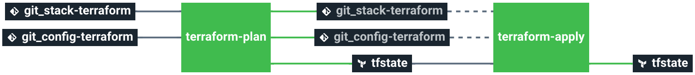

# stack-infra

Service catalog infrastructure stack

This stack will create Amazon vpc and a bastion ec2 server you might require to deploy other stacks.

This stack shall be used for demo purposes only.

# Architecture

  * **EC2** Amazon Elastic Compute Cloud
  * **S3** Amazon Simple Storage Service
  * **VPC** Amazon Virtual Private Cloud

# Requirements

In order to run this task, a couple elements are required:

  * Having an S3 bucket to store Terraform remote states [Here](https://docs.aws.amazon.com/quickstarts/latest/s3backup/step-1-create-bucket.html)

# Details

## Pipeline

> **Warning** The terraform-plan job is automatically triggered upon resources changes and the terraform-apply is automatically triggered upon tfstate file changes (after terraform-plan job completes)

**Jobs description**

  * `terraform-plan`: Terraform job that will simply make a plan of the infrastructure's stack.
  * `terraform-apply`: Terraform job similar to the plan one, but will actually create/update everything that needs to. Please see the plan diff for a better understanding.
  * `terraform-destroy`: :warning: Terraform job meant to destroy the whole stack - **NO CONFIRMATION ASKED**. If triggered, the full project **WILL** be destroyed. Use with caution.

**Params**

|Name|Description|Type|Default|Required|
|---|---|:---:|:---:|:---:|
|`aws_access_key`|Amazon AWS access key for Terraform. see value format [Here](https://docs.cycloid.io/advanced-guide/integrate-and-use-cycloid-credentials-manager.html#vault-in-the-pipeline)|`-`|`((aws_aws.access_key))`|`True`|
|`aws_secret_key`|Amazon AWS secret key for Terraform. see value format [Here](https://docs.cycloid.io/advanced-guide/integrate-and-use-cycloid-credentials-manager.html#vault-in-the-pipeline)|`-`|`((aws_aws.secret_key))`|`True`|
|`aws_region`|Amazon AWS region to use for Terraform.|`-`|`eu-west-1`|`True`|
|`keypair_public`|SSH public key to provision on Bastion to connect to it.|`-`|`((custom_keypair.ssh_pub))`|`True`|
|`config_git_repository`|Git repository url containing the config of the stack.|`-`|`git@github.com:olivier2t/config.git`|`True`|
|`config_git_branch`|Branch of the config git repository.|`-`|`main`|`True`|
|`config_git_private_key`|SSH key pair to fetch the config git repository.|`-`|`((ssh_github.ssh_key))`|`True`|
|`terraform_storage_bucket_name`|AWS S3 bucket name to store terraform remote state file.|`-`|`($ organization_canonical $)-terraform-remote-state`|`True`|

## Terraform

**Inputs**

|Name|Description|Type|Default|Required|
|---|---|:---:|:---:|:---:|
|`cidr`|The CIDR of the VPC|`-`|`10.0.0.0/16`|`False`|
|`private_subnets`|The private subnets for the VPC|`list`|`["10.0.1.0/24"]`|`False`|
|`public_subnets`|The public subnets for the VPC|`list`|`["10.0.0.0/24"]`|`False`|
|`bastion_count`|Number of bastions to create|`-`|`1`|`False`|
|`bastion_instance_type`|Instance type for the bastion|`-`|`t3.micro`|`False`|
|`bastion_allowed_networks`|Networks allowed to connect to the bastion using SSH|`list`|`["0.0.0.0/0"]`|`False`|

**Outputs**

| Name | Description |
|------|-------------|
| bastion_ip | The EIP attached to the bastion EC2 server |
| bastion_sg | The bastion security group ID. |
| bastion_sg_allow | The security group ID to allow SSH traffic from the bastion to the instances in the VPC |
| vpc_id | The VPC ID for the VPC |
| vpc_cidr | The CIDR of the VPC |
| private_subnets | The private subnets for the VPC |
| public_subnets | The public subnets for the VPC |